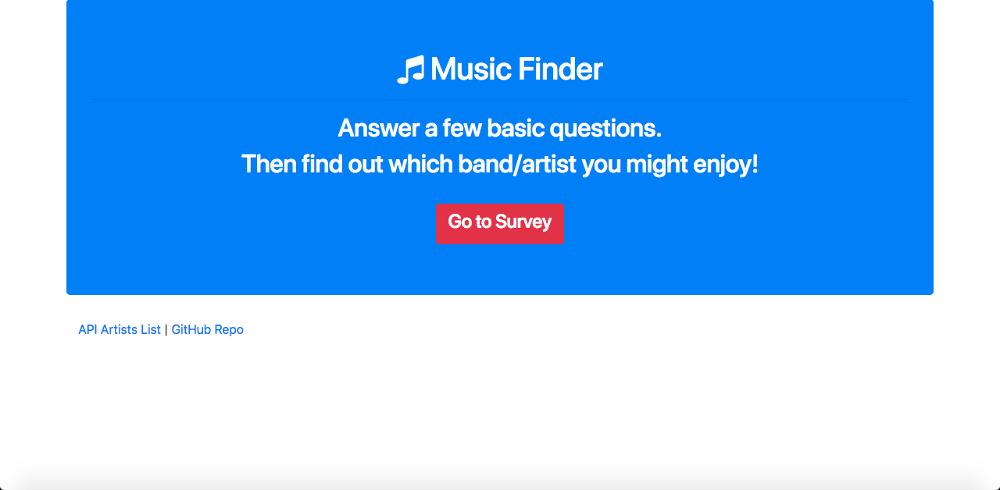
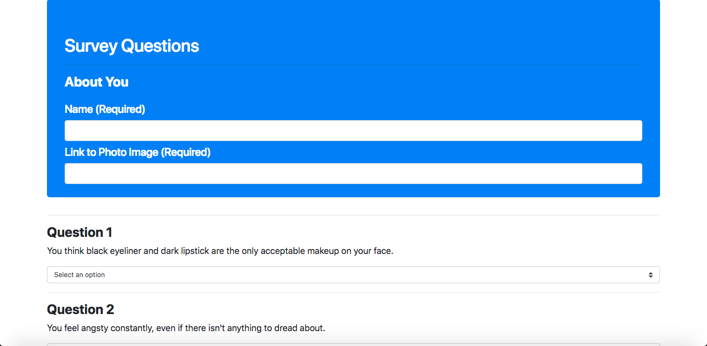
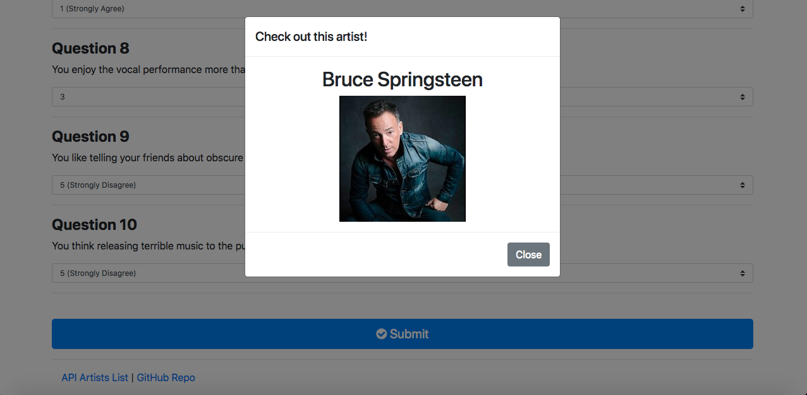

# FriendFinder

## Overview
In this homework assignment for Rutgers Coding Bootcamp, students were asked to build a compatibility-based "FriendFinder" application -- basically a dating app. This full-stack site will take in results from users' surveys, then compare their answers with those from other users. The app will use Express to handle routing and then display the name and picture of the user with the best overall match.

I personally changed the theme to be a Music Finder, which matches the user with a database of artists instead of friends. I also disabled the push to that database after taking the users' surveys since it wasn't necessary for this particular purpose.

## Heroku link
https://michaelxpeng-friendfinder.herokuapp.com/

## Screenshots
Home page

Survey page

Modal

## Dependencies
* Node.js
* Express
* body-parser
* path